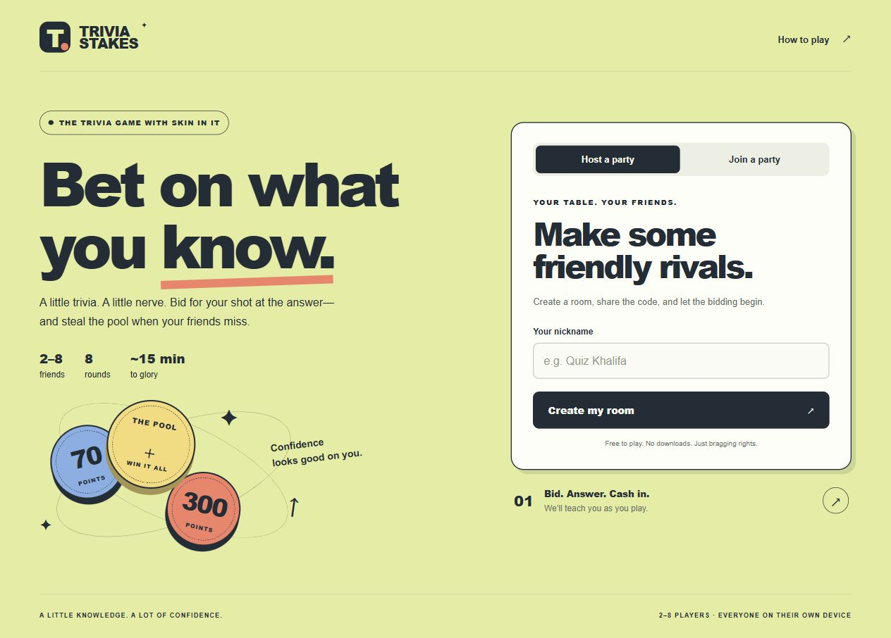

# Pool Party

**Bid on what you know.** A real-time trivia auction for 2–8 friends, each on their own device. Built as an original portfolio project, with a server-authoritative game engine and a responsive browser interface.



## Run it

Requires **Node.js 22 or newer**. There are no third-party runtime dependencies and no installation step.

```sh
npm start
```

Open **http://localhost:3000**. Create a room, then open the same address in another independent browser tab to join by code. Each tab gets its own player session. Use a newly opened tab rather than duplicating a tab, because browsers may clone a duplicated tab’s session storage.

For a phone or another computer on the same Wi-Fi, use the **Same-network devices** address printed by the server. The host computer must stay running, and its firewall must permit inbound access to the selected port. A loopback URL such as localhost always refers to the device opening it.

The server defaults to port 3000 and listens on all local interfaces. Set `PORT`, `HOST`, and (for production) `PUBLIC_ORIGIN` in your hosting environment. `.env.example` documents the variables; the application does not automatically load `.env` files.

## How to play

1. Everyone starts with **1,000 points**. There are **8 regular rounds**.
2. See the category, but not the question. For 25 seconds, openly raise your own bid from **50 to 300**, in increments of 10. You may pass by not bidding. You cannot bid more than your balance.
3. Bidders answer in descending bid order. A tie goes to the player who placed that current bid earlier. You have **15 seconds** to choose one of four options and lock it in. Only the active player receives the options; other players see the question and success or failure, but never the selected wrong option.
4. Correct: earn your bid plus the pool. Your stake is not deducted first. Incorrect or timed out: lose your bid into the pool, then the next bidder answers the same question. Unattempted bids cost nothing.
5. If every bidder misses, read the bonus explanation. Everyone can play, including players who passed or have fewer than 50 points. No new wagers. Buzz first and answer correctly to claim the pool.
6. A bonus miss removes that player for the **entire bonus sequence**. The remaining players receive a **fresh question**, after a three-second countdown. There is no extra point deduction. If everyone misses, or nobody buzzes within 20 seconds, the pool clears. Everyone returns next regular round.
7. The highest score after eight rounds wins. Tied leaders share the win. The host can start a rematch with the same room code.

**Example:** Alice bids 100 and misses: 1,000 → 900, pool = 100. Bob bids 70 and answers correctly: 1,000 + 70 + 100 = **1,170**. The pool resets.

The opening screen teaches the regular loop. Bonus rules appear only when needed; the complete rules remain available throughout the game. The bonus explanation allows up to 25 seconds to read and ends earlier when all connected players are ready. The first bonus question starts after a countdown, so reading time never consumes the answer timer.

## Project structure

```text
public/                  Browser interface, styles, and favicon
server/index.js          HTTP API, SSE streams, sessions, room lifecycle
server/trivia.js         Live-question loading, caching, rate limits, fallback
shared/game.js           Server-side game state machine and scoring
shared/questions.js      Original question bank and accepted answer matching
tests/game.test.js       Scoring, auction, bonus, timing, and capacity checks
tests/server.test.js     Independent sessions, stream, race, and security checks
tests/trivia.test.js     Live format, concurrency, repeat filtering, and outages
docs/architecture.md     Design decisions and production tradeoffs
docs/deployment.md       Live-hosting and GitHub preparation
.github/workflows/ci.yml Automated checks on pushes and pull requests
Dockerfile               Portable single-process deployment
```

Despite its folder name, `shared/` is **not served to the browser**. The server never sends accepted answers before a reveal.

## Verify

```sh
npm run check
npm test
```

The tests cover the 1,170-point example, tied bids, balance limits, information hiding, passers winning a bonus pool, removal across fresh bonus questions, simultaneous buzzer requests, expired answer turns, all eight rounds, and the worst-case 72-question game.

The first version was also exercised in two independent browser sessions: create, join, ready, start, live bids, wrong answer, and correct answer with the expected score. The phone breakpoint was checked for horizontal overflow at a 390-pixel viewport. Physical-device and public-hosting checks remain to be done.

## Technical decisions

- **Server authority:** clients request actions; the server controls scores, timers, answer validation, and buzzer ownership.
- **Server-sent events:** actions use HTTP, updates push to every player immediately. SSE suits a predominantly server-to-browser update stream and reconnects automatically.
- **Atomic turns:** mutations are synchronous in one Node process. A turn identifier prevents a delayed request from affecting a newer question.
- **No accounts:** random session tokens restore a player after a refresh. Room codes identify a room, not a player’s authority.
- **Small dependency surface:** modern browser JavaScript and Node’s built-in HTTP, crypto, and test modules keep setup approachable.

## Current scope

This is a working **local first playable version**, not a deployed public service. GitHub CI is configured but has not run on GitHub yet, and the Docker image has not been built in this environment.

Rooms and sessions live in memory; restarting the server resets them. Run one server instance. A future horizontally scaled version needs a shared transactional room store or per-room actors. SSE needs a host and reverse proxy that allow long-lived streaming responses. Static-only hosting does not run this game’s server.

Answers are multiple choice, with one correct option and three distractors. The server shuffles the options once per question and validates the submitted choice ID, so spelling and wording do not affect scoring. Options are private to the active player and contain no correctness marker.

**Live questions are enabled by default.** The server loads up to 50 medium-difficulty multiple-choice questions from Open Trivia Database while players join the lobby, then fills the deck to 80 with curated questions. It makes no external calls during timed rounds. If the service is unavailable, malformed, rate-limited, or exhausted, the 80-question curated bank supplies a complete game. The host's start control waits for preparation to finish, and the lobby shows readiness. Rematches load a new deck.

The fallback bank spans Space, Geography, History, Science, Books, Movies, Technology, Music, Gaming, and Motorsport. Live data adds broader category coverage. Regular and bonus questions use the prepared deck without repeats within that game. The server tracks the last 500 played question fingerprints and prioritizes unseen prompts; repeat tracking and cache reset on a server restart. A finite fallback bank eventually repeats. Set `TRIVIA_LIVE=false` for offline play.

Difficulty is an editorial/provider label; calibrate it with players before a competition. See [question bank notes](docs/question-bank.md) and [live-question design](docs/live-trivia.md). Network latency can affect fastest-finger ordering: the first valid request to reach the server wins.

The average game duration depends on the number of players and misses. The landing page’s 15-minute estimate is a target, not a guarantee; extensive bonus play can take longer.

See [deployment instructions](docs/deployment.md) and [architecture notes](docs/architecture.md).


### Host category selection
In the lobby, the host chooses at least four of the ten categories. All are selected by default. The same selection filters regular and bonus questions, including live questions and curated fallback. Changes reset player readiness and prepare a new deck; only the latest selection is applied. Rematches retain the selection.

A small selected bank may repeat questions after its unique prompts are consumed. The lobby displays this notice. A complete deck is prepared before play, so an outage or bonus-heavy game never adds an unselected category. Space and Motorsport currently use curated questions; live questions are matched to the other supported category labels. Cache and repeat history reset on server restart.
